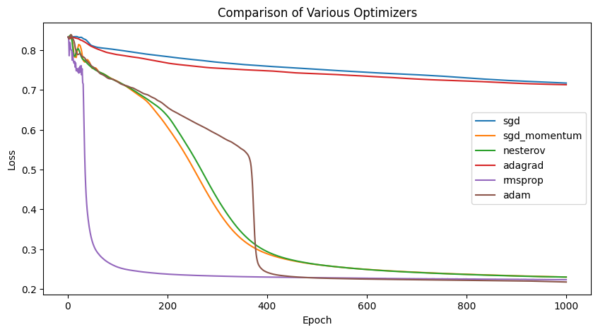

## Dataset

* Took 500 images of each class from the CIFAR-10 dataset, totaling to 5000 images.
* Imported them as NumPy arrays and normalized them between 0 & 1.
* Refer to the [notebook](./optimizers.ipynb) for more information.

---

## Two Layer Neural Network

```python
## Dense(64)
W1 = np.random.randn(3072, 64) 

## Dense(10)
W2 = np.random.randn(64, 10)
```

---

#### Forward Pass

```python
## forward pass
X1 = np.matmul(X, W1)       ## (N, 64)
X2 = np.maximum(X1, 0)      ## (N, 64)
X3 = np.matmul(X2, W2)      ## (N, 10)

y_pred = softmax(X3)        ## (N, 10)

L = loss(y, y_pred)

loss_list.append(L)
```

---

#### Backward Pass

```python
dL_by_dW1 = (X.T @ (((y_pred - y) @ W2.T) * (X1 > 0))) / len(y)
dL_by_dW2 = (X2.T @ (y_pred - y)) / len(y)
```

---

## Optimizers

#### SGD

Vanilla gradient descent (despite the name “stochastic”).

```python
optim = {
    "type": "sgd",
    "momentum": 0,
}

W1 -= lr * dL_by_dW1
W2 -= lr * dL_by_dW2
```

---

#### SGD with Momentum

Accumulates gradients to build momentum during weight updates, helping to converge faster.

```python
optim = {
    "type": "sgd",
    "momentum": 0.9,
    "velocity_dw1": 0,
    "velocity_dw2": 0
}

optim["velocity_dw1"] = optim["momentum"] * optim["velocity_dw1"] + lr * dL_by_dW1
optim["velocity_dw2"] = optim["momentum"] * optim["velocity_dw2"] + lr * dL_by_dW2

W1 -= optim["velocity_dw1"]
W2 -= optim["velocity_dw2"]
```

---

#### Nesterov

Looks ahead by applying momentum to the weights (which is the approximate position of where the Weight vector is going to be) before the gradient step. This helps to converge even faster.

```python
optim = {
    "type": "nesterov",
    "momentum": 0.9,
    "velocity_dw1": 0,
    "velocity_dw2": 0
}

## update the weights prior to the forward pass
if optim["type"] == "nesterov":
    W1 -= optim["momentum"] * optim["velocity_dw1"]
    W2 -= optim["momentum"] * optim["velocity_dw2"]

optim["velocity_dw1"] = optim["momentum"] * optim["velocity_dw1"] + lr * dL_by_dW1
optim["velocity_dw2"] = optim["momentum"] * optim["velocity_dw2"] + lr * dL_by_dW2

W1 -= lr * dL_by_dW1
W2 -= lr * dL_by_dW2
```

---

#### Adagrad

Accumulates the square of the  gradients, and during weight update additionaly divide the gradient with the square root of the accumulated gradients.

```python
optim = {
    "type": "adagrad",
    "cache_dw1": 0,
    "cache_dw2": 0
}

optim["cache_dw1"] += dL_by_dW1**2
optim["cache_dw2"] += dL_by_dW2**2

W1 -= lr * dL_by_dW1 / (np.sqrt(optim["cache_dw1"]) + eps)
W2 -= lr * dL_by_dW2 / (np.sqrt(optim["cache_dw2"]) + eps)
```

---

#### RMSProp

A modification of Adagrad using exponentially weighted average of squared gradients. Introduced by Geoff Hinton.

```python
optim = {
    "type": "rmsprop",
    "cache_dw1": 0,
    "cache_dw2": 0,
    "decay": 0.999
}

optim["cache_dw1"] = optim["decay"] * optim["cache_dw1"] + (1 - optim["decay"]) * dL_by_dW1**2
optim["cache_dw2"] = optim["decay"] * optim["cache_dw2"] + (1 - optim["decay"]) * dL_by_dW2**2

W1 -= lr * dL_by_dW1 / (np.sqrt(optim["cache_dw1"]) + eps)
W2 -= lr * dL_by_dW2 / (np.sqrt(optim["cache_dw2"]) + eps)
```

---

#### Adam

An advanced optimizer combining Momentum and RMSProp. Has shown better convergence in practice.

```python
optim = {
    "type": "adam",
    "m_dw1": 0,
    "m_dw2": 0,
    "v_dw1": 0,
    "v_dw2": 0,
    "b1": 0.9,
    "b2": 0.99
}

optim["m_dw1"] = optim["b1"] * optim["m_dw1"] + (1 - optim["b1"]) * dL_by_dW1
optim["m_dw2"] = optim["b1"] * optim["m_dw2"] + (1 - optim["b1"]) * dL_by_dW2

optim["v_dw1"] = optim["b2"] * optim["v_dw1"] + (1 - optim["b2"]) * dL_by_dW1**2
optim["v_dw2"] = optim["b2"] * optim["v_dw2"] + (1 - optim["b2"]) * dL_by_dW2**2

W1 -= lr * optim["m_dw1"] / (np.sqrt(optim["v_dw1"]) + eps)
W2 -= lr * optim["m_dw2"] / (np.sqrt(optim["v_dw2"]) + eps)
```

---

## Comparison



* **Adam** converges faster than all other optimizers.
* **Adagrad** and **Vanilla SGD** struggled to converge and got stuck.
* After Adam, **RMSProp** performed best, followed by **Nesterov** and **SGD with Momentum**.